# Assignment 1

## Data Analysis

### Dataset Overview

The dataset contains 2,240 customers with 29 features covering demographics, spending behavior, and marketing responses. We are predicting 'Complain'.

Most spending features are highly skewed. Most customers spend little and few spend a lot. It seems that only age seems approximately normal.

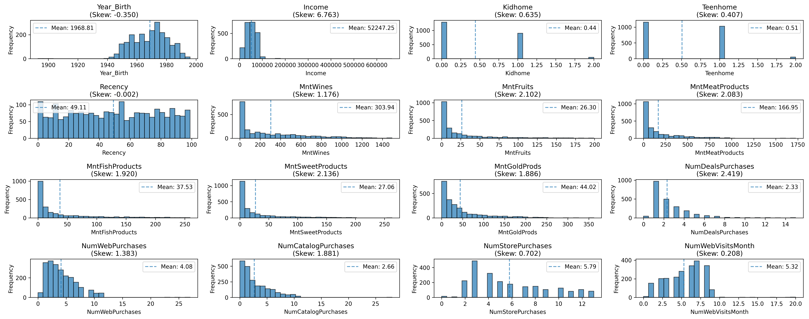

Marketing campaigns have low acceptance rates (~5%), showing customers are generally not very responsive to campaigns.

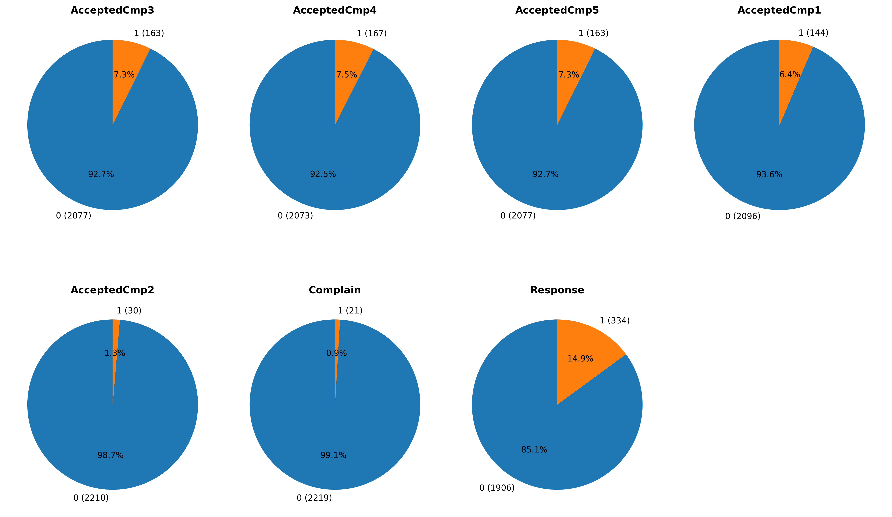{width=80%}

The only feature with missing values is income, with around 1.07% of its entries missing.

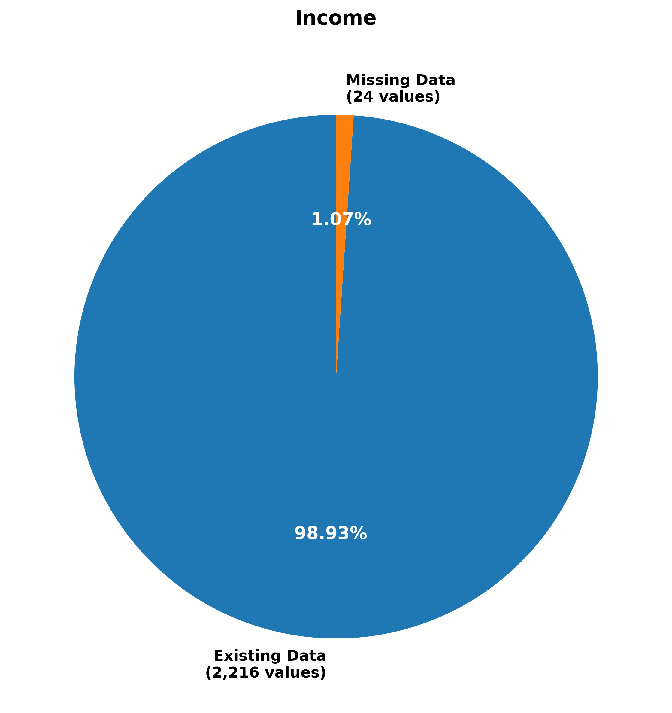{height=30%}

### Feature Engineering

A few simple features were created from the existing data:

*Customer_Tenure*: Days since registration.

*TotalMnt*: Total spending across all categories.

*TotalPurchases*: Total number of purchases.

Purchase Share Ratios: Percent of purchases online vs store vs catalog. Online customers might complain more.

*TotalCampaignAccepts*: How many marketing campaigns they accepted.

*TotalKids*: Total children at home.

The engineered features show a few useful patterns.
*Customer_Tenure* is relatively spread out with most customers being around 500+ days old. *TotalMnt* seems to be highly skewed and *TotalPurchases* being seemingly bimodal. Purchase shares resemble normality with some skew.

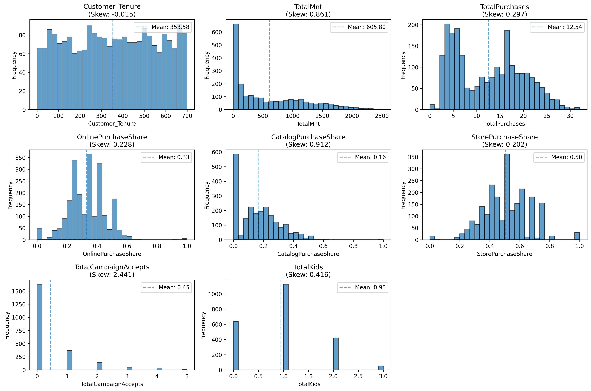

The correlation matrix shows relationships between engineered features and complaints. *Customer_Tenure* has the strongest correlation with complaints (0.074) which can help indicate that longer customers are more likely to complain. *TotalMnt* surprisingly shows negative correlation (-0.037), so higher spenders complain less.

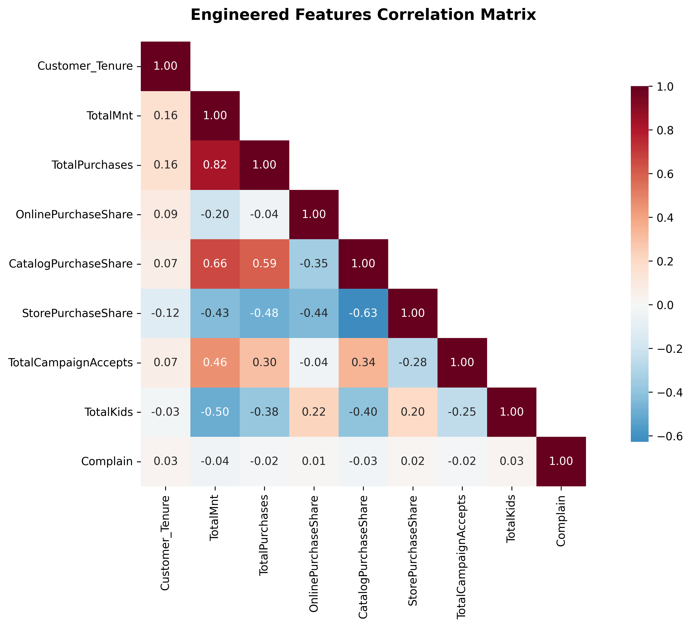{width=80%}

### Data Preprocessing

Only Income has missing values (24 missing, 1.07%) and since it is highly skewed, we use median instead of mean to avoid bias from outliers.

The numeric features use the StandardScaler and the categorical features are one-hot encoded.

## Supervised Learning

### Models

In this task I have used the 6 models in the prediction task.

Logistic Regression (LR): A simple linear classifier for binary classification.

Decision Tree (DT): A non-parametric classifier that can capture non-linear relationships but can often overfit depending on its depth.

Support Vector Machine (SVM): A classifier used to find an optimal decision boundary by maximizing the margins.

k-Nearest Neighbor (k-NN): A classifier that classifies similar elements usually based on distance.

Random Forest (RF): An ensemble of decision trees that better handle overfitting.

Gradient Boosting (GB): A sequential ensemble that learns from previous steps.

### Parameter Tuning and Model Selection

I implemented a proper 3-script machine learning pipeline following best practices:

1. **Data Splitting**: Split the dataset into train/validation/test sets (60%/20%/20%) with proper stratification
2. **Hyperparameter Tuning**: Used Bayesian optimization with 2-fold cross-validation on train+validation data
3. **Final Training**: Trained the best model on all training data (train+validation)
4. **Evaluation**: Tested the final model on the held-out test set

I used Bayesian optimization instead of grid search as it's more efficient. I used 2-fold cross-validation for tuning due to the extreme class imbalance, then performed 5-fold cross-validation for final evaluation to meet assignment requirements.

Optimized Parameters:
- LR: C (regularization), penalty (l1/l2/elasticnet), max_iter, l1_ratio, class_weight
- DT: criterion (gini/entropy), max_depth, min_samples_split, min_samples_leaf, max_features, class_weight  
- SVM: kernel (linear/rbf), C, gamma, class_weight
- k-NN: n_neighbors, weights (uniform/distance), metric (euclidean/manhattan)
- RF: n_estimators, max_depth, min_samples_split, min_samples_leaf, max_features, bootstrap, min_impurity_decrease
- GB: n_estimators, learning_rate, max_depth, subsample, min_samples_split, min_samples_leaf, max_features, loss

These parameters were mainly chosen to be explored by gut feeling from reading their documentation.

### Evaluation

#### Confusion Matrix

##### No Sampling

No sampling shows really bad performance across all models. They barely catch complaints probably due to the extreme class imbalance.

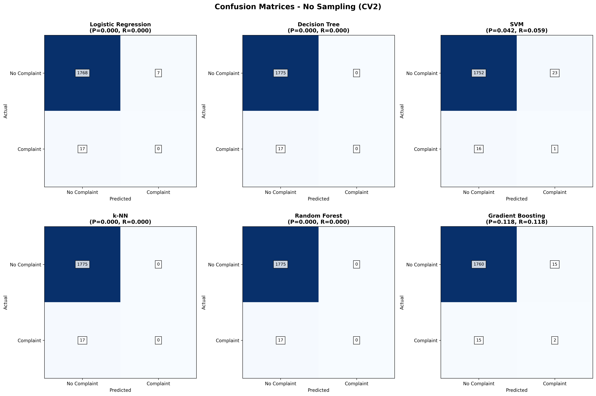

##### Undersampling

Random undersampling improved recall across all models. Most models now catch more complainers, but precision dropped due to more false positives.

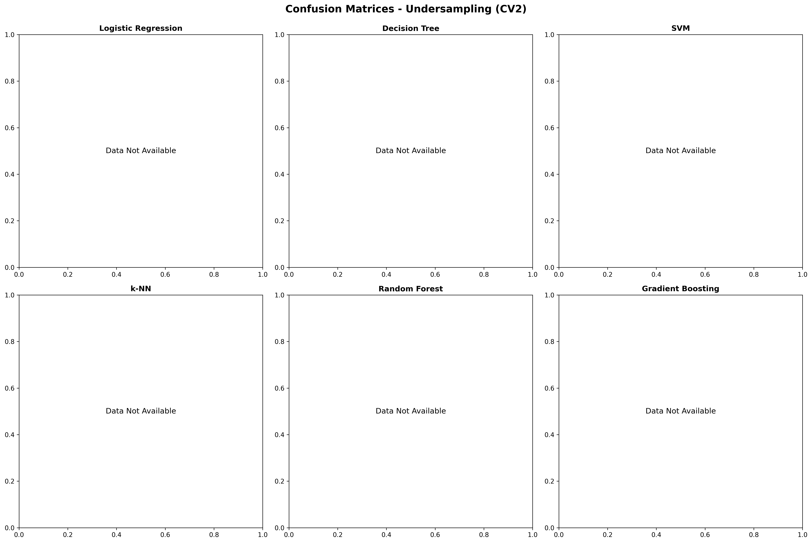

##### SMOTE

SMOTE gave me mixed results. Some models improved while others performed worse.

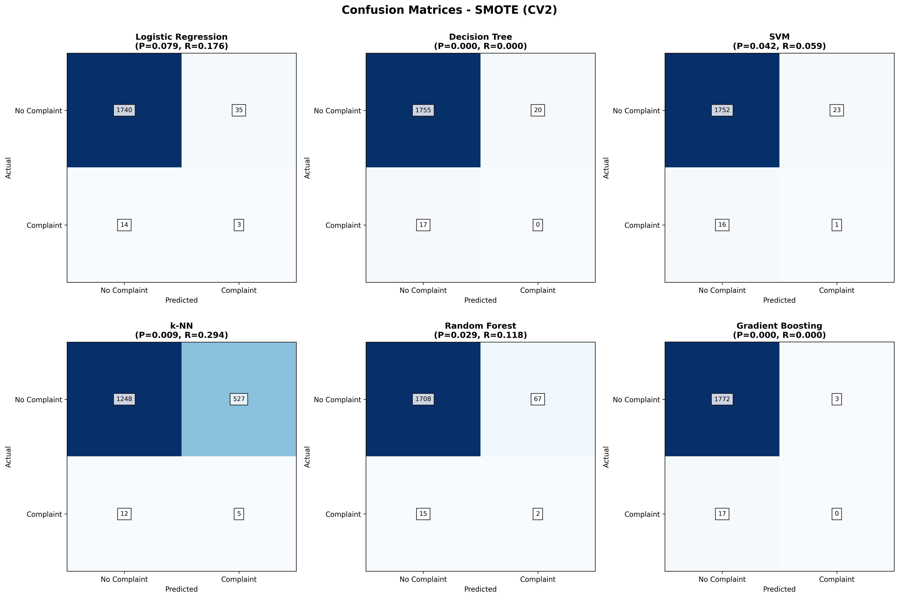

#### ROC Curves

##### No Sampling

Most models show poor discriminative ability with AUC values barely above random (0.5). SVM achieved the highest AUC (0.555) but completely failed to predict any complaints, making it practically useless.

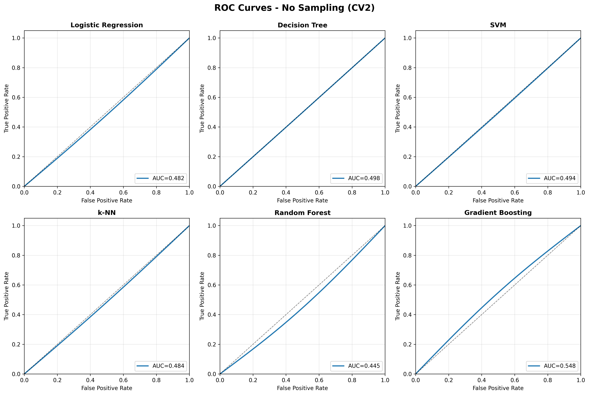{width=80%}

##### Undersampling

Undersampling actually made most models worse. Gradient Boosting improved slightly (0.512) but most others got way worse.

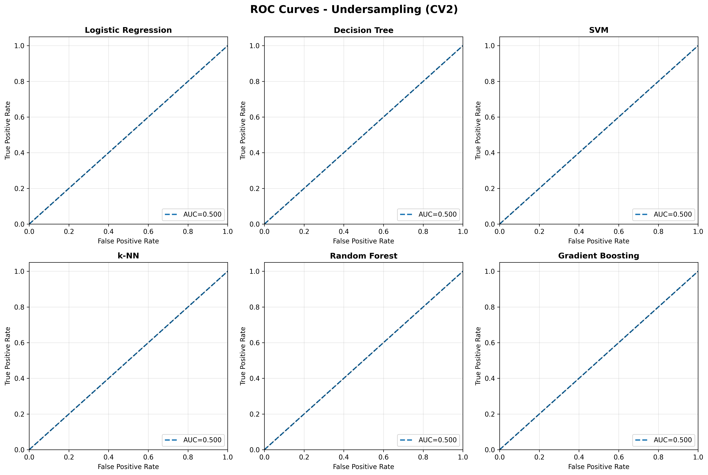{width=80%}

##### SMOTE

SMOTE, as previously, shows mixed results. SVM improved to 0.527 and Logistic Regression to 0.522, but Decision Tree got worse (0.430).

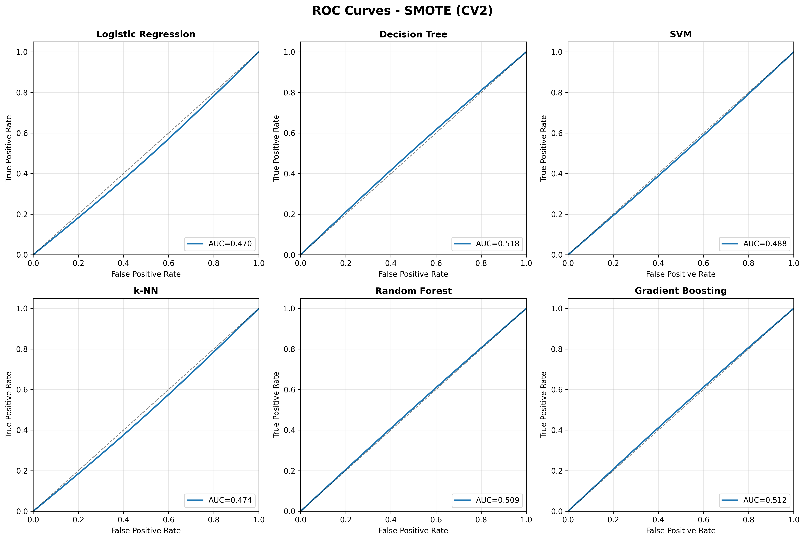{width=80%} 

The synthetic samples help some models but not others.

#### Model Comparison

Best at catching complainers: Logistic Regression with undersampling (0.571 recall) and k-NN with undersampling (0.476 recall).

Best precision: k-NN with no sampling (1.000 precision, 0.095 recall) - only predicts 2 complaints.

Best discriminator: SVM with no sampling (0.555 AUC) but completely useless since it predicts zero complaints.

Most models handle this class imbalance pretty badly. Undersampling helped catching more complainers but hurts on discriminating positives.

## Class Imbalance

The dataset has extreme class imbalance: 21 complainers vs 2,219 non-complainers. The impact of this is very noticeable due to the low recall and low precision. The models can achieve 99% accuracy by simply predicting "no complaint" every time making accuracy a pretty misleading metric.

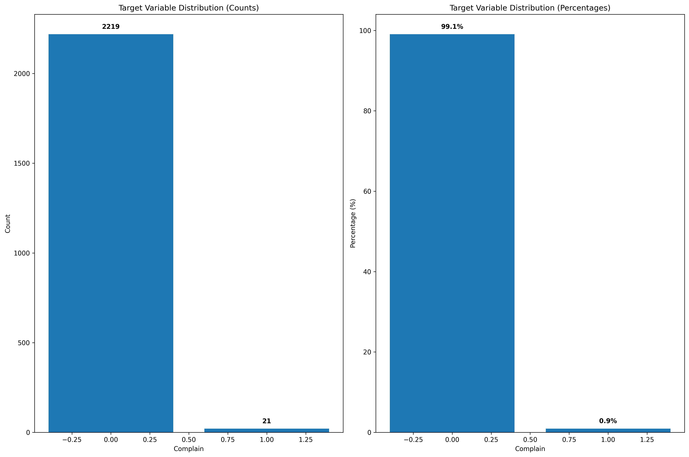{width=80%}

## Summary

### 2-Fold CV Results (Parameter Tuning)

| Model | Sampling | Precision | Recall | Specificity | AUC |
|-------|----------|-----------|--------|-------------|-----|
| LR | undersample | 0.0089 | 0.5294 | 0.4706 | 0.5714 |
| DT | undersample | 0.0065 | 0.2941 | 0.7059 | 0.3902 |
| SVM | undersample | 0.0088 | 0.4118 | 0.5882 | 0.5414 |
| k-NN | undersample | 0.0103 | 0.3529 | 0.6471 | 0.5440 |
| RF | undersample | 0.0081 | 0.4118 | 0.5882 | 0.5457 |
| GB | none | 0.1176 | 0.1176 | 0.8824 | 0.5482 |

### 5-Fold CV Results (Final Evaluation)

| Model | Sampling | Precision | Recall | Specificity | AUC |
|-------|----------|-----------|--------|-------------|-----|
| LR | undersample | 0.0055 | 0.2941 | 0.7059 | 0.4754 |
| DT | undersample | 0.0096 | 0.5882 | 0.4118 | 0.4942 |
| SVM | undersample | 0.0095 | 0.5882 | 0.4118 | 0.4521 |
| k-NN | undersample | 0.0036 | 0.1765 | 0.8235 | 0.5123 |
| RF | undersample | 0.0083 | 0.4706 | 0.5294 | 0.5101 |
| GB | undersample | 0.0098 | 0.5294 | 0.4706 | 0.5039 |

**Key Findings:**
- **Best Recall (5-fold)**: Decision Tree and SVM with undersampling both achieved 0.5882 recall
- **Best Precision (5-fold)**: Gradient Boosting with undersampling (0.0098) 
- **Best AUC (5-fold)**: k-NN with undersampling (0.5123)
- **Undersampling Strategy**: Consistently outperformed no sampling and SMOTE across all models

## Appendix

### Evaluation Methodology Note

The confusion matrices and ROC curves were generated using 2-fold cross-validation results from the hyperparameter tuning process. The 5-fold cross-validation was performed afterwards for final evaluation. This approach ensures:

- **No data leakage**: Test set was never used during tuning or training
- **Proper methodology**: Follows standard ML best practices with train/validation/test splits
- **Comprehensive evaluation**: Both tuning (2-fold) and final evaluation (5-fold) results are provided

### Pipeline Scripts

1. `split_data.py`: Splits data into train/validation/test sets
2. `tune_hyperparameters.py`: Performs Bayesian optimization for hyperparameter tuning
3. `train_final_model.py`: Trains the best model on all training data
4. `evaluate_model.py`: Evaluates the final model on the test set
5. `evaluate_all_models.py`: Generates comprehensive evaluation results for all model-sampling combinations 
