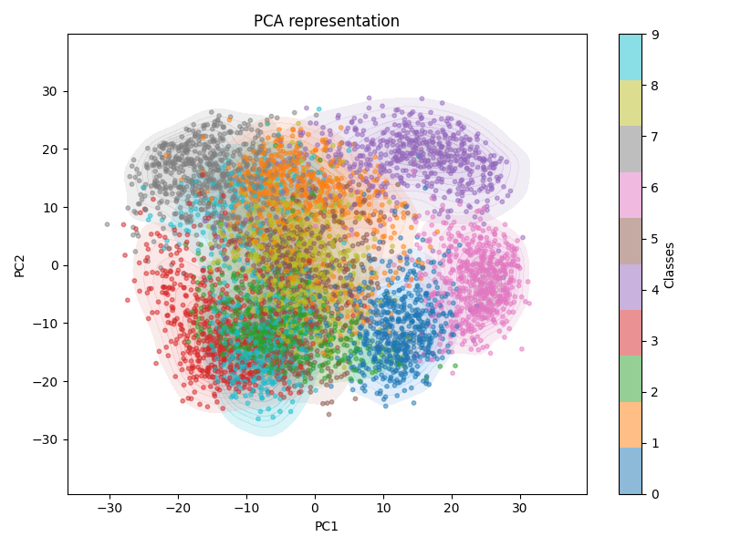
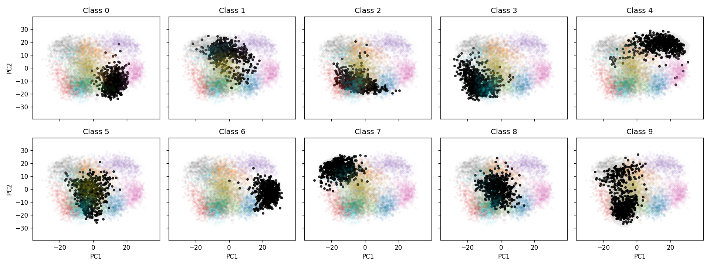

# Report

## PCA Analysis

The Smoothness Assumption does appear to be satisfied. Nearby points in PCA 2D do share labels more than chance, yet clusters are not quite cleanly separated.

Neighborhood coherence using Silhouette scores show that the PCA 2D space is less coherent than the original 64D space.

## Semi-Supervised Learning

The semi-supervised learning methods did not perform as well as the fully-supervised baseline. The SelfTrainingClassifier performed better than LabelPropagation, but both methods were not as good as the baseline.

## Conclusion