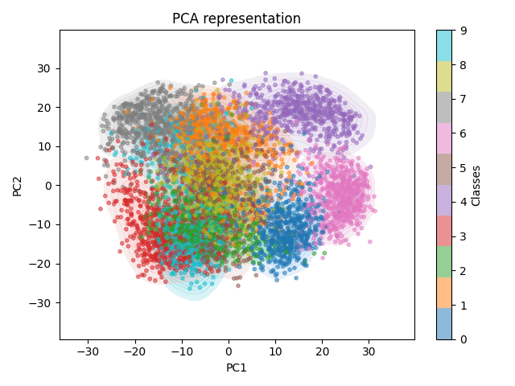
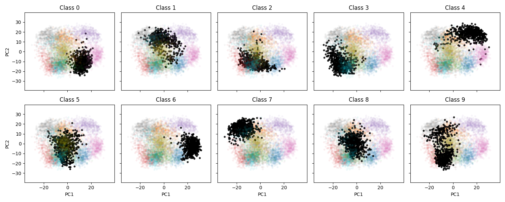
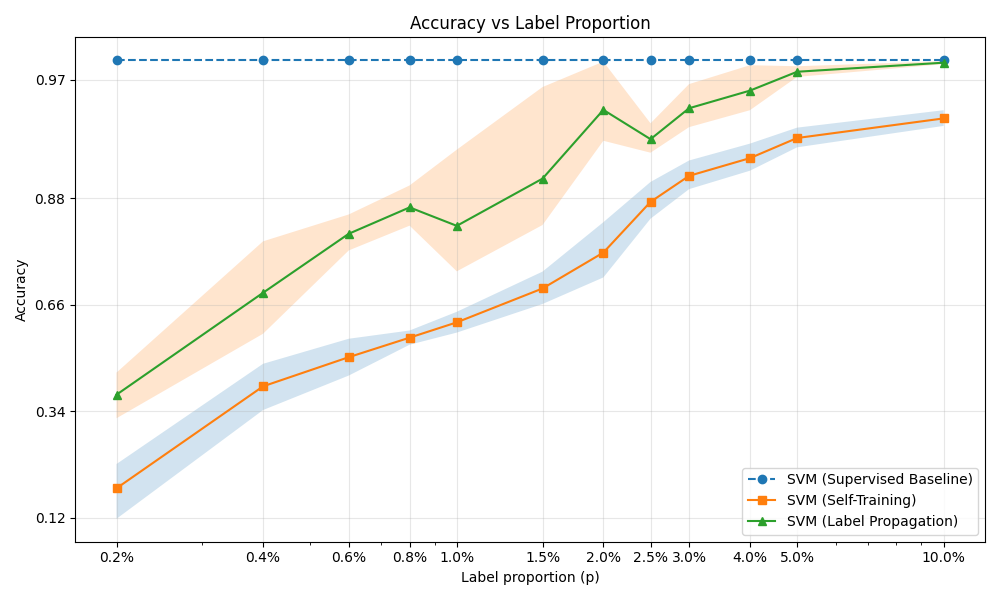
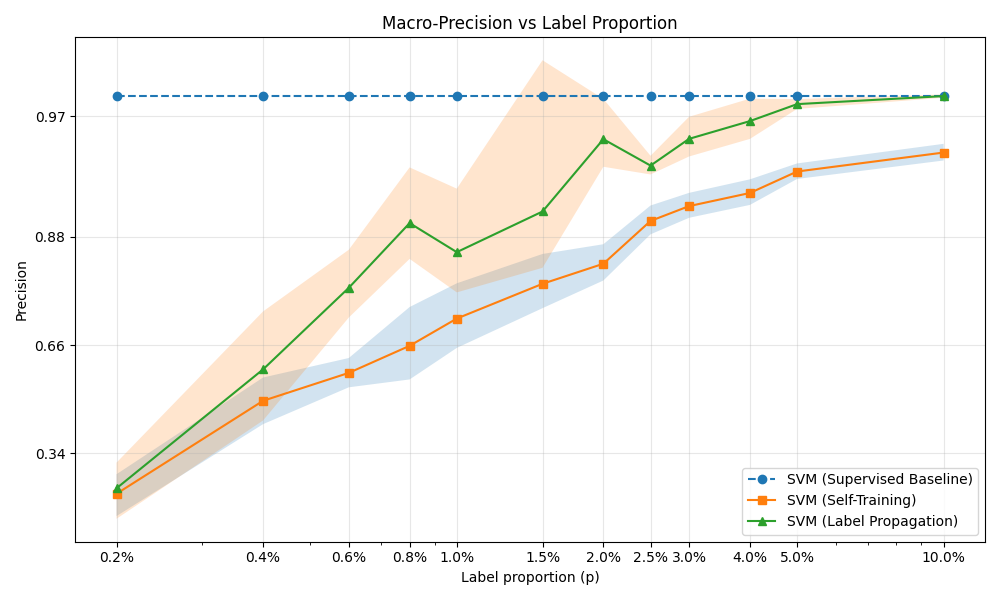
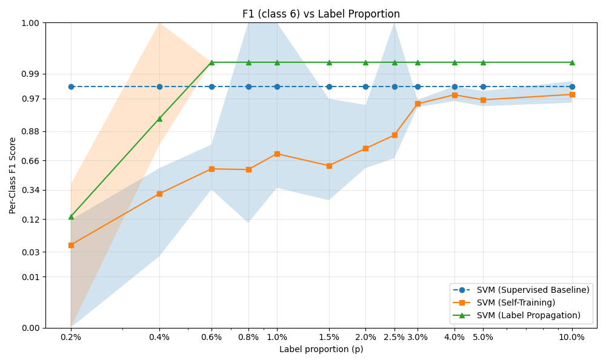
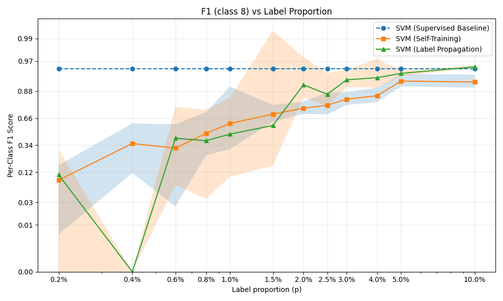

# Report

## PCA Analysis

PCA was used to project the 64-dimensional data onto a 2D space. The visualization shows that nearby points tend to share labels, confirming **the Smoothness Assumption is satisfied**.

I have also calculated the silhouette score, which quantifies this observation, showing the original 64D space is more structurally coherent (0.33) than the 2D projection (0.27). But even so, the underlying cluster structure is still mostly preserved.

## Supervised Learning Baseline

The SVM was trained on the entire 70% labeled training dataset to establish a baseline. On the 30% test set, the fully supervised model achieved an accuracy and macro F1-score of 98%, representing the upper bound.

## Semi-Supervised Learning Results

To test SSL effectiveness, three models were compared across 12 label proportions: 

- A supervised SVM (on the labeled subset only).
- SelfTrainingClassifier with SVM base.
- LabelPropagation with KNN kernel. 

### Overall Performance

The following plots show results of the two SSL methods against the fully supervised baseline. Each experiment was run 5 times, with plots showing mean and standard deviation.

### Per-Class F1 for Classes "6" and "8"

## Discussion

### Comparison to Supervised Baseline

The SSL methods start with much lower results at very small label proportions but improve as more labeled data is added. LP consistently outperforms ST across all metrics and proportions, winning at every single proportion tested (0.2% to 10%). At p=10%, LP's results become very close to the fully supervised baseline. For example, its macro F1 reaches ~0.98, matching the baseline. ST also improves significantly at higher proportions but does not reach the same level, maxing out at a macro F1 of ~0.95.

### Semi-Supervised Algorithm Performance

Overall, LP was the superior SSL algorithm. ST struggled at very low proportions of labeled data. This was particularly evident for digit "8." At p=0.4% ST had an F1 of 0.36 for this class, while LP failed to classify it correctly at all (F1 of 0.00). This suggests that for some classes, ST can learn better from very few examples, while LP may need more labeled data to get started. However, with more labeled data (p=10%), LP becomes much better, reaching an F1 of 0.96.

### Ideas for Improvement

The most obvious immediate improvement would be hyperparameter tuning. For a visual task like digit recognition, data augmentation could also be helpful. Additionally, calibrating the SVM's probability outputs in ST could help improve accuracy. Another possibility is to use a different base model for ST, such as a neural network.